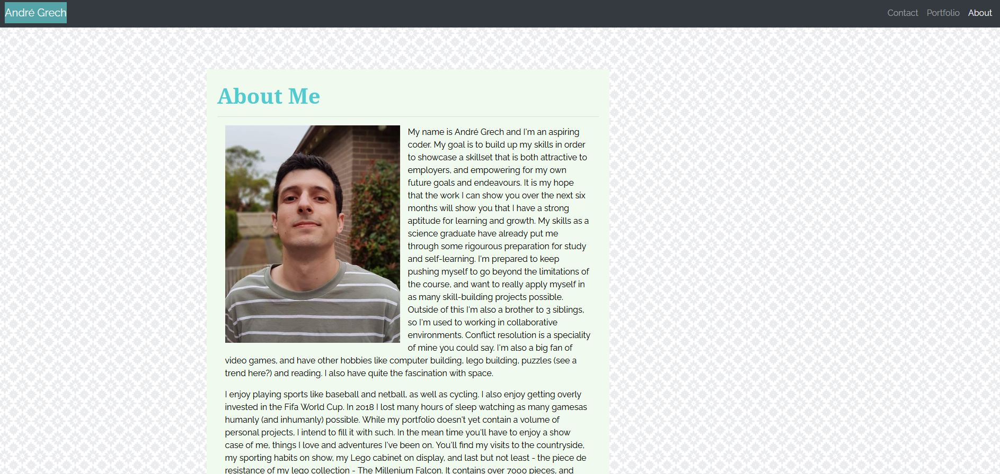

# Unit 02 Responsive Portfolio

Responsive design ensures that web applications render well on a variety of devices and window or screen sizes. As a developer, you will likely be asked to create a mobile-first application or add responsive design to an existing application.

## Contents

- `index.html`, `portfolio.html` and `contact.html` files for a personal portfolio website

- Image assets sourced under creative commons license and personal images not for public distribution.

### Code

- Structure and layout sourced from bootstrap documentation and examples. Further changes made to suit brief specification and grid layout.

### Sample of deployed application

_Snapshot of deployed index.html page_

### Minimum Requirements

- Functional, deployed application

- GitHub repository with README describing the project

- Navbar must be consistent on each page.

- Navbar on each page must contain links to Home/About, Contact, and Portfolio pages.

- All links must work.

- Must use semantic html.

- Each page must have valid and correct HTML. (use a validation service)

- Must contain your personalized information. (bio, name, images, links to social media, etc.)

- Must properly utilize Bootstrap components and grid system.

### Authors

- Original code by bootstrap used as framework
- Added code by \_Andr&eacute; Grech - 27/8/2020

---

© 2019 Trilogy Education Services, a 2U, Inc. brand. All Rights Reserved.
